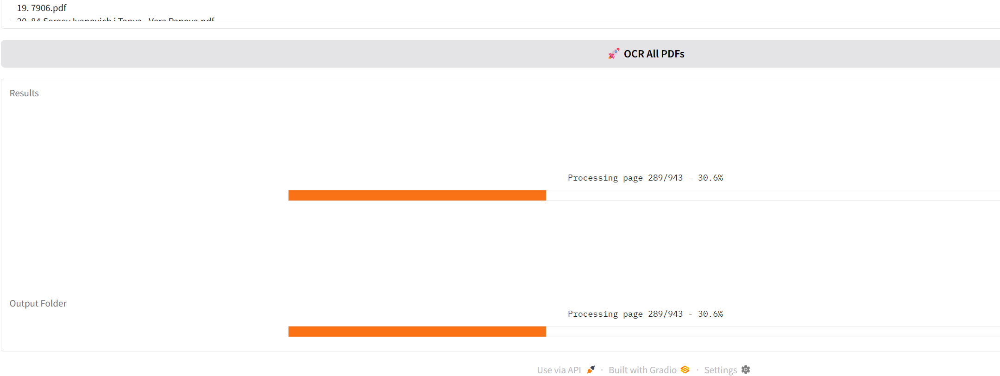
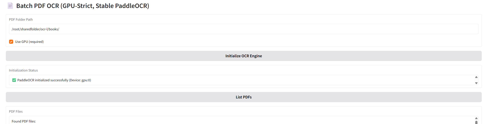

<div align="center">
  
  <br>
</div>

# Batch OCR (PaddleOCR) in Docker

I created Batch OCR to process hundreds and thousands of PDF files into text files using a very efficient model. I tested almost everything available on Hugging Face and finally chose PaddleOCR for its speed and accuracy. The Gradio app lets you select a folder and recursively process all PDFs into text for indexing or LLM training, etc.

This project packages a fast, reliable PDF-to-text pipeline using PaddleOCR. It scans a folder recursively, extracts embedded text when available, falls back to OCR when needed, filters low-quality text, and writes clean `.txt` files while mirroring the original folder structure under `ocr_results`.

The app runs inside Docker on Windows or Linux and can use either GPU (recommended) or CPU.

<div align="center">

[](https://docker.com)
[](https://learn.microsoft.com/windows)
[](https://linux.org)
[](https://python.org)
[](https://github.com/PaddlePaddle/PaddleOCR)

</div>

## Overview

```
/workspace
  └── <your PDFs>  →  Recursive scan
                      ├─ Embedded text via PyMuPDF
                      └─ OCR fallback via PaddleOCR
                           ↓
                      Quality filter → /workspace/ocr_results/*_ocr.txt
```

## Fast Track

```bash
# Build (Windows/Linux/macOS)
docker build -t batch-ocr:latest -f Dockerfile .

# Run
# Windows
.\run-d.bat
# Linux/macOS
sh run.sh
```

## Features

- Recursive processing of PDFs in a chosen root folder
- Embedded text extraction via PyMuPDF, with OCR fallback via PaddleOCR
- Simple quality filtering to avoid noisy output
- Output mirrors input structure under `ocr_results/` with `_ocr.txt` files
- Gradio UI to set folder, initialize OCR, list PDFs, and run batch OCR
- GPU or CPU mode selectable from the UI

<div align="center">
  
  <br>
</div>

## System Requirements

- Docker 24+
- Windows 11 or Linux (Ubuntu/Debian recommended)
- Optional GPU acceleration:
  - NVIDIA GPU + drivers on host
  - NVIDIA Container Toolkit (nvidia-docker2)

## Requirements

- Docker 24+
- For GPU acceleration: NVIDIA driver and NVIDIA Container Toolkit (nvidia-docker2)
- For CPU-only runs: no GPU requirements

## Build

Run from the `batch-ocr` folder:

```bash
docker build -t batch-ocr:latest -f Dockerfile .
```

## Run

### Windows (PowerShell or cmd)

Use the included script:

```bat
.\run-d.bat
```

This starts the container and launches the Gradio app. It maps your current folder to `/workspace` inside the container and exposes the UI at `http://localhost:7888`.

### Linux/macOS (Docker)

Use the included script:

```sh
sh run.sh
```

This runs the container with GPU (if available), maps the current folder to `/workspace`, and starts the app. The UI is available at `http://localhost:7888`.

### macOS (native, CPU-only)

If you prefer running outside Docker on macOS (CPU-only), use the helper script which creates a venv, installs dependencies, and runs a quick OCR smoke test:

```sh
bash batch-ocr/osx_setup_run_test.sh
```

To launch the classic batch OCR UI (`app.py`) after setup:

```sh
source batch-ocr/.venv/bin/activate
python batch-ocr/app.py
# Open http://127.0.0.1:7888 and uncheck "Use GPU" in the UI
```

To launch the PP-Structure + OCR UI (`app2.py`) after setup:

```sh
source batch-ocr/.venv/bin/activate
python batch-ocr/app2.py
# Open http://127.0.0.1:7888 and uncheck "Use GPU" in the UI
```

If you see an `ImportError` for `PPStructureV3` when running `app2.py`, upgrade document components in the venv:

```sh
source batch-ocr/.venv/bin/activate
pip install --upgrade paddleocr paddlex
```

<div align="center">
  
  <br>
</div>

## Using the App

1. Open `http://localhost:7888` in your browser.
2. Set “Root PDF Folder” to a path under `/workspace` (the host’s current directory is mounted there). Example: `/workspace/pdfs`.
3. Click “Initialize OCR” (toggle “Use GPU” on or off as needed).
4. Click “List PDFs” to confirm discovery.
5. Click “OCR All PDFs” to process all PDFs recursively.

Outputs are written to `/workspace/ocr_results`, preserving the subfolder structure. Each PDF produces a matching `_ocr.txt` file. Errors (if any) are written as `_ERROR.txt` in the same mirrored folder.

### Using app2.py (PP-Structure + OCR)

`app2.py` adds PP-StructureV3 for document parsing (tables, layout), alongside OCR:

- Choose language and structure options (orientation, unwarp, textline, charts).
- Choose exports: plain text, JSON, Markdown.
- Adjust render scale (PDF → image) for quality/speed tradeoffs.
- Batch run writes:
  - Text files to `ocr_results/` (mirroring input tree)
  - Structured outputs to `doc_results/<pdf-name>/` per PDF

Note: PP-Structure is heavier than plain OCR; on CPU (macOS), expect slower processing.

## Headless CLI (no UI)

Run batch OCR from the terminal using the CLI script. This works with either the classic OCR pipeline or the PP-Structure pipeline, and respects macOS CPU defaults.

```sh
# Classic OCR (app.py pipeline)
source batch-ocr/.venv/bin/activate   # if using macOS native setup
python batch-ocr/ocr_cli.py --mode classic --root /path/to/pdfs

# Structure + OCR (app2.py pipeline)
python batch-ocr/ocr_cli.py \
  --mode structure \
  --root /path/to/pdfs \
  --lang en \
  --render-scale 2.0 \
  --export-txt --export-json --export-md \
  --force-ocr           # optional

# GPU toggle (defaults to off on macOS, on elsewhere)
python batch-ocr/ocr_cli.py --mode classic --root /path/to/pdfs --no-gpu
python batch-ocr/ocr_cli.py --mode structure --root /path/to/pdfs --use-gpu
```

Outputs are written under `ocr_results/` (and `doc_results/` for structure mode). A `_batch_summary.txt` is saved in the text output root.

## Ports and Volumes

- Ports
  - 7888: Gradio UI (container → host)
- Volumes
  - Windows: `-v "%cd%":/workspace`
  - Linux/macOS: `-v "$(pwd)":/workspace`

Everything under your current host directory is available inside the container at `/workspace`.

## Notes

- GPU mode requires PaddlePaddle with CUDA support in the container and a host with NVIDIA Container Toolkit. If you see a CUDA support error, uncheck “Use GPU” and run on CPU.
- The default “Root PDF Folder” is `/workspace`. Adjust as needed based on where your PDFs live within the mounted path.
- You can also start the container in interactive mode and run the app manually:

  - Windows:
    ```bat
    docker run --gpus all --rm -it -p 7888:7888 -v "%cd%":/workspace batch-ocr:latest bash
    python /workspace/app.py
    ```

  - Linux/macOS:
    ```sh
    docker run --gpus all --rm -it -p 7888:7888 -v "$(pwd)":/workspace batch-ocr:latest bash
    python /workspace/app.py
    ```

## Project Layout

- `app.py` — Gradio app and OCR pipeline using PaddleOCR and PyMuPDF
- `app2.py` — Advanced UI with PP-StructureV3 document parsing (JSON/Markdown) + batch OCR
- `Dockerfile` — Base image with PaddleOCR and required libraries
- `run-d.bat` — Windows script to run the container and start the app
- `run.sh` — Linux/macOS script to run the container and start the app
- `osx_setup_run_test.sh` — macOS native setup + smoke test (creates `.venv`, installs CPU deps)
- `assets/` — Optional images and logo files

## Troubleshooting

- GPU not available:
  - Error: `PaddlePaddle CUDA support is required for GPU mode.`
  - Fix: Uncheck “Use GPU” in the UI, or install NVIDIA drivers + NVIDIA Container Toolkit on the host.
  - macOS note: GPU (CUDA) is not supported; run CPU and uncheck “Use GPU”.
- No PDFs found:
  - Ensure the path is inside `/workspace` and contains `.pdf` files; use “List PDFs” to verify discovery.
- Permission denied on output:
  - Ensure the host directory is writable; the app writes to `/workspace/ocr_results`.
- Processing is slow on CPU:
  - Use GPU mode if available. For large batches, consider reducing image render scale in `app.py` (search for `fitz.Matrix(2, 2)` and adjust to `(1, 1)` to trade accuracy for speed).
- Output quality is inconsistent:
  - Tweak heuristics in `app.py` (`is_readable_text`) to relax/tighten filters.

### macOS dependency notes

- The `batch-ocr/osx_setup_run_test.sh` script pins versions known to work on macOS CPU:
  - `paddleocr==2.7.3` (legacy `.ocr()` result shape used by the apps)
  - `numpy<2` (for OpenCV compatibility with PaddleOCR 2.7.x)
  - `huggingface_hub<1.0` (required by the current Gradio import path)
- First run downloads OCR models to `~/.paddleocr` and `~/.paddlex`.

## License

This repository uses PaddleOCR and other open-source packages; consult their respective licenses for details.

## Credits

- PaddleOCR (PaddlePaddle)
- PyMuPDF (fitz)
- Gradio
- OpenCV / Pillow

## Changelog

- v1.0: Initial Dockerized Batch OCR with Gradio UI, Windows and Linux run scripts, GPU/CPU modes.
